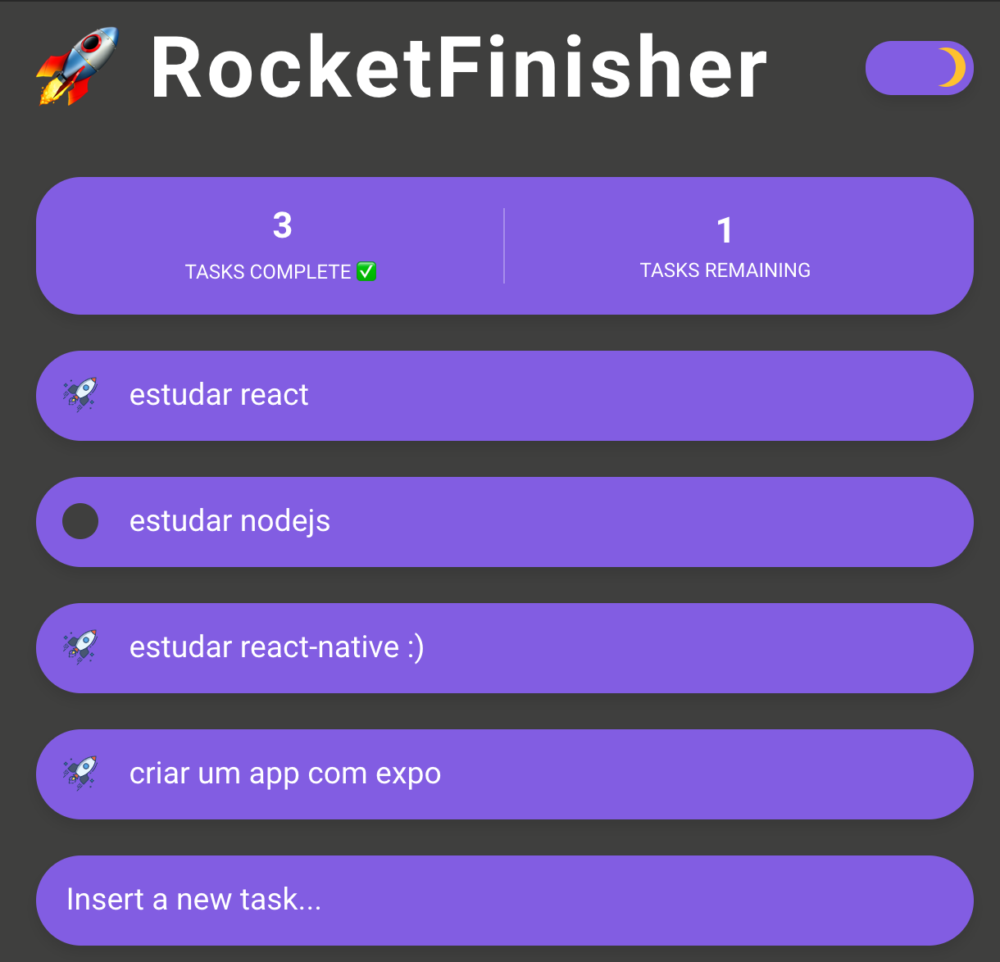
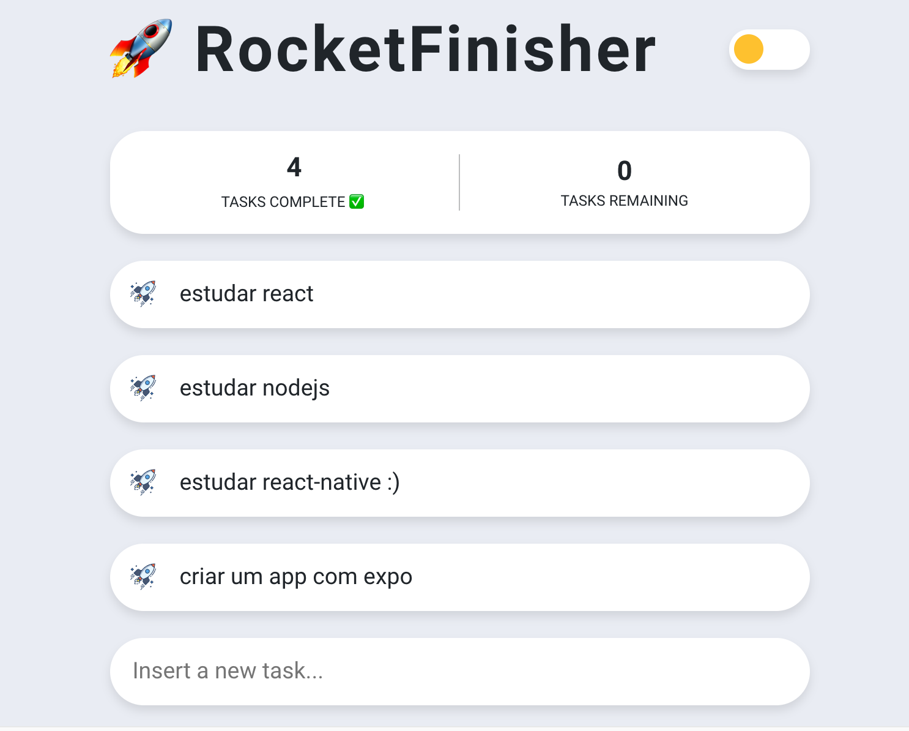

<h1 align="center">
   🚀 <a href="#"> RocketFinisher </a>
</h1>

<h3 align="center">
  Sample todo list app to learn [Recoil](https://recoiljs.org/). 
  It's a fork from [jacques-blom](https://github.com/jacques-blom/recoil-todo-list)
</h3>


<h4 align="center"> 
	 Status: Finished
</h4>

<p align="center">
 <a href="#layout">Layout</a> • 
 <a href="#how-it-works">How it works</a> • 
 <a href="#tech-stack">Tech Stack</a> • 
 <a href="#author">Author</a> • 
 <a href="#user-content-license">License</a>

</p>

---

## Layout

<p align="center">



</p>

---

## How it works

1. Clone the repo

```bash
git clone git@github.com:tgmarinho/rocketfinisher.git
```

2. Install dependencies using Yarn

```bash
cd rocketfinisher
yarn
```

3. Start the development server

```bash
yarn start
```
 
---

## Tech Stack

The following tools were used in the construction of the project:

#### **WEB** ([React](https://reactjs.org/) + [TypeScript](https://www.typescriptlang.org/))

-   React
-   Recoil
-   Styled-Components
-   Typescript


> See the file [package.json](https://github.com/tgmarinho/rocketfinisher/blob/master/package.json)


---

## Refactored

<a href="https://blog.rocketseat.com.br/author/thiago/">
 
 <br />
 <sub><b>Thiago Marinho</b></sub></a> <a href="https://blog.rocketseat.com.br/author/thiago/" title="Rocketseat"></a>
 <br />

[](https://twitter.com/tgmarinho) [](https://www.linkedin.com/in/tgmarinho/)
[](mailto:tgmarinho@gmail.com)

---

## License

This project is under the license [MIT](./LICENSE).

Made with love by Thiago Marinho 👋🏽 [Get in Touch!](Https://www.linkedin.com/in/tgmarinho/)

